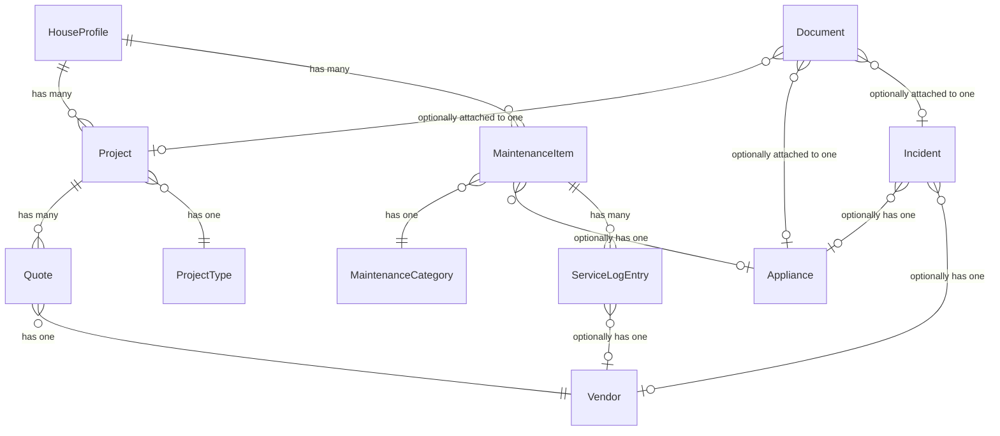

+++
title = "Data Model"
weight = 3
description = "Entities, relationships, and the design rationale behind them."
linkTitle = "Data Model"
+++

micasa stores everything in a single SQLite database. This page explains the
entities, how they connect, and why the model is shaped the way it is.

## House Profile

Your home's physical and financial details. One per database.

### Why this matters

- The profile is the root of the data tree -- everything else hangs off it.
- Having a single canonical record prevents duplicate-address confusion and
  gives the dashboard a fixed anchor point.

## Projects

Anything you want done to your house, from "fix the squeaky door" to
"redo the kitchen."

### Why this matters

- **Pre-seeded types** (Renovation, Repair, Landscaping, ...) keep naming
  consistent -- no "Renovation" vs "renovation" vs "Reno" drift.
- **Status lifecycle** (ideating through completed/abandoned) enables the
  settled-project toggle that hides finished work from the default view.

## Quotes

Vendor quotes linked to a project.

### Why this matters

- Every quote **requires a project**, preventing orphan records. The project
  column is a live link (<kbd>enter</kbd> jumps to it).
- **Vendor records are shared** across quotes and service log entries, so
  contact info lives in one place.

## Maintenance

Recurring upkeep tasks with an optional appliance link.

### Why this matters

- **Pre-seeded categories** (HVAC, Plumbing, Electrical, ...) keep filtering
  and sorting clean, same rationale as project types.
- The optional **appliance link** enables bidirectional navigation: jump from
  a task to its appliance, or drill from an appliance into all its tasks.
- The **service log** is a drill column -- press <kbd>enter</kbd> to open the full
  history for a given task.

## Service Log

Time-ordered records of when a maintenance task was performed, by whom, and
at what cost.

### Why this matters

- Entries **live inside a maintenance item** (accessed via drill), so they
  always have context -- no floating service records.
- The optional vendor link distinguishes DIY from hired work and carries
  contact info automatically.

## Appliances

Physical equipment in your home.

### Why this matters

- Appliances are referenced *by* maintenance items and incidents, not the other
  way around. The `Maint` drill column provides the reverse view: from any
  appliance, see everything you're doing to keep it running.

## Incidents

Household issues and repairs -- things that go wrong and need attention.

### Why this matters

- Incidents track reactive work (something broke), complementing maintenance
  (scheduled upkeep) and projects (planned improvements).
- **Severity levels** (urgent, soon, whenever) drive dashboard ordering so the
  most pressing issues surface first.
- Optional **appliance and vendor links** connect an incident to the equipment
  involved and the person you've called to fix it.
- Resolving an incident is a soft delete: the row stays visible (strikethrough)
  so you keep a history of what went wrong.

## Documents

File attachments stored as BLOBs inside the database.

### Why this matters

- Documents use a **polymorphic FK** (`EntityKind` + `EntityID`) to link to
  any entity type -- projects, incidents, appliances, quotes, maintenance
  items, vendors, or service log entries. This avoids a separate join table
  per entity.
- File data lives inside SQLite, so `micasa backup backup.db` is a complete
  backup with no sidecar files.
- Drill columns on the Projects and Appliances tabs give direct access to
  linked documents.

### Extraction columns

Documents store extraction results alongside the file data:

- `ExtractedText` -- plain text from the PDF reader or OCR
- `OCRData` -- raw tesseract TSV output (bounding boxes, confidence scores)

These columns are populated by the extraction pipeline (text -> OCR). The LLM
layer produces structured operations (create/update) dispatched through the
Store API to create related entities (vendors, quotes, maintenance items).

## Vendors

People and companies you hire. Shared across quotes, service log entries, and
incidents.

### Why this matters

- Because vendors are shared, updating a phone number **once** updates it
  everywhere.
- Vendors are created implicitly through forms -- type a name and micasa
  finds or creates the record.
